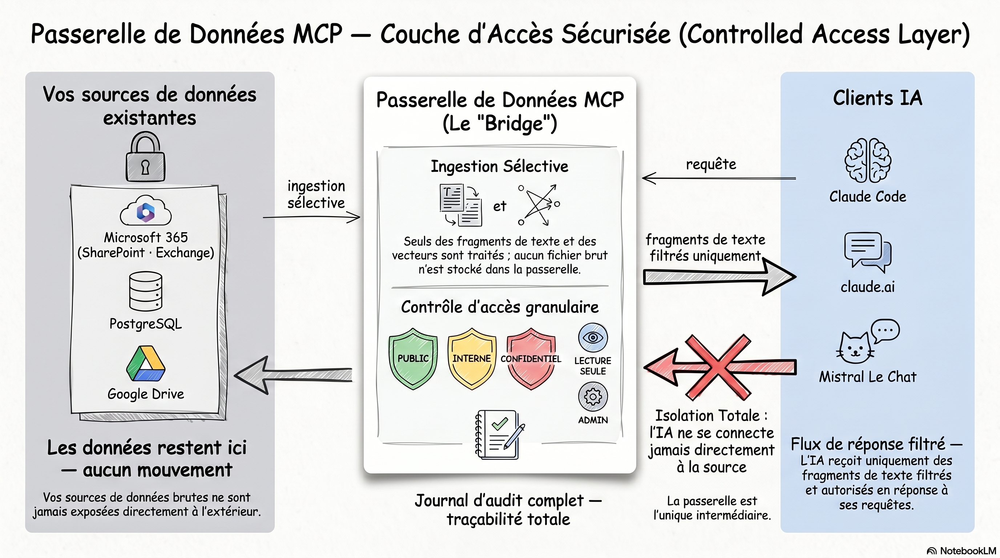

<div align="center">

# The Secure Bridge Between Your Enterprise Data and AI

**Give your AI agents access to your internal data — without exposing credentials, bypassing security, or rebuilding your infrastructure.**

[](https://github.com/RegionalPartner/mcp-data-gateway/actions/workflows/ci.yml)
[](LICENSE)

🇬🇧 English | [🇫🇷 Français](README.fr.md)

*Built and open-sourced by [Ancoris](https://www.ancoris.fr) — AI & digital consulting, Groupe AXTOM*

</div>

---

[Model Context Protocol (MCP)](https://modelcontextprotocol.io) is the emerging standard for connecting AI models to enterprise systems. This gateway is the **secure bridge** between your internal data and any MCP-compatible AI client. Tested with **Claude Code**, **claude.ai**, and **Mistral**.

The data ingestion side is intentionally not part of this release — structuring and loading your data is where enterprise work happens, and it differs for every organisation. What you get here is the full, production-hardened gateway layer: authentication, authorisation, semantic search, audit, and Kubernetes-ready deployment.

## Contents

- [Live demo](#live-demo)
- [What it does](#what-it-does)
- [Security model](#security-model)
- [Stack](#stack)
- [Quickstart](#quickstart-local)
- [Documentation](#documentation)
- [About Ancoris](#about-ancoris)

---

## Live demo

A running instance with anonymised sample data is available at:

```
https://mcp.37.59.24.118.nip.io
```

Connect it to Claude Code:

```bash
claude mcp add mcp-data-gateway --transport http https://mcp.37.59.24.118.nip.io/mcp
```

Demo keys:

| Key | Role | What you can see |
|-----|------|-----------------|
| `demo-readonly-key-001` | READ_ONLY | PUBLIC + INTERNAL documents, employees (no salary) |
| `demo-admin-key-001` | ADMIN | All documents including CONFIDENTIAL, full employee table |

Try asking: *"List the available data sources"* or *"Search for documents about HR policy"*.

---

<div align="center">



</div>

## What it does

Four MCP tools, exposed over OAuth 2.0 PKCE (streamable HTTP transport):

| Tool | Description |
|------|-------------|
| `list_sources` | Lists tables and document collections accessible to the current key, including visible columns and classification tiers |
| `query_database` | Queries structured tables with role-based column filtering and parameterised SQL (injection-safe) |
| `search_documents` | Keyword search over internal documents — returns text fragments, never raw files |
| `semantic_search_documents` | Vector similarity search (pgvector + Ollama) — finds conceptually related content even without exact keyword matches |

Every tool call is written to an immutable audit log.

---

## Security model

Authentication flows through OAuth 2.0 PKCE — handled automatically by Claude Code, claude.ai, and Mistral (the three tested clients). API keys are HMAC-peppered and BCrypt-hashed. **Row-level security is enforced at the PostgreSQL layer**, not in application code.

| Role | Structured data | Documents |
|------|----------------|-----------|
| `READ_ONLY` | All columns except `salary` | PUBLIC + INTERNAL |
| `ADMIN` | All columns | PUBLIC + INTERNAL + CONFIDENTIAL |

Full reference — threat model, RLS design, AES-256 encryption, dual audit sinks: [docs/SECURITY_HARDENING.md](docs/SECURITY_HARDENING.md)

---

## Stack

| Layer | Technology |
|-------|-----------|
| Runtime | Java 21, Spring Boot 3.5 |
| MCP | Spring AI MCP Server (streamable HTTP, protocol 2025-03-26 + 2025-11-25) |
| Database | PostgreSQL 16 — data, encrypted documents, audit logs, pgvector embeddings |
| Migrations | Flyway |
| Embeddings | Ollama (local, no external API dependency) |
| Infrastructure | Kubernetes (OVH), Terraform, NGINX Ingress, cert-manager (Let's Encrypt) |
| CI | GitHub Actions — tests, OWASP CVE scan, Trivy container scan, Gitleaks |

---

## Quickstart (local)

**Requirements:** Docker, Java 21

```bash
# Start PostgreSQL + Ollama
docker compose up -d

# Run the app
./gradlew bootRun

# App is on http://localhost:8080
curl -H "X-API-Key: demo-readonly-key-001" http://localhost:8080/actuator/health
```

```bash
./gradlew test   # Run tests (Docker required for Testcontainers)
```

---

## Documentation

| Document | What it covers |
|----------|---------------|
| [Getting started](docs/GETTING_STARTED.md) | Step-by-step guide — connect Claude Code to the live demo |
| [Configuration](docs/CONFIGURATION.md) | All environment variables, dev profile, secret generation |
| [Security hardening](docs/SECURITY_HARDENING.md) | Threat model, HMAC auth, RLS, AES-256 encryption, dual audit sinks |
| [OVH deployment](docs/OVH_DEPLOYMENT.md) | Full Kubernetes / Terraform walkthrough |
| [Architecture](docs/ARCHITECTURE.md) | Design decisions, request pipeline, adding new tools |
| [Extending the gateway](docs/EXTENDING.md) | Ingestion pipeline, connectors, observability, orchestration |
| [Build quality](docs/BUILD_QUALITY.md) | Test suite, coverage thresholds, OWASP CVE scan, Trivy, Gitleaks |
| [For AI agents](docs/for-ai-agents.md) | Machine-readable tool reference |

---

## About Ancoris

**Ancoris** is the digital and AI consulting division of [Groupe AXTOM](https://www.ancoris.fr), a French group specialising in economic development and enterprise real estate — *Champion de la Croissance* (Les Échos) since 2023.

We built this gateway because our clients — intercommunalities, economic development agencies, and enterprise operators — hold years of structured data that their teams cannot easily query or reason over. Connecting that data safely to AI agents is one of the most valuable things we do.

- Structure and ingest your data assets into a gateway like this one
- Define classification tiers and access roles to match your security policy
- Deploy and operate on your preferred cloud (OVH, Azure, GCP)
- Train your teams to use AI agents against their own data

This repository is the open-source foundation. The data pipeline is the engagement. Visit [ancoris.fr](https://www.ancoris.fr) or open a [GitHub Discussion](https://github.com/RegionalPartner/mcp-data-gateway/discussions).

---

## License

MIT — see [LICENSE](LICENSE). Copyright (c) 2026 Groupe AXTOM.
